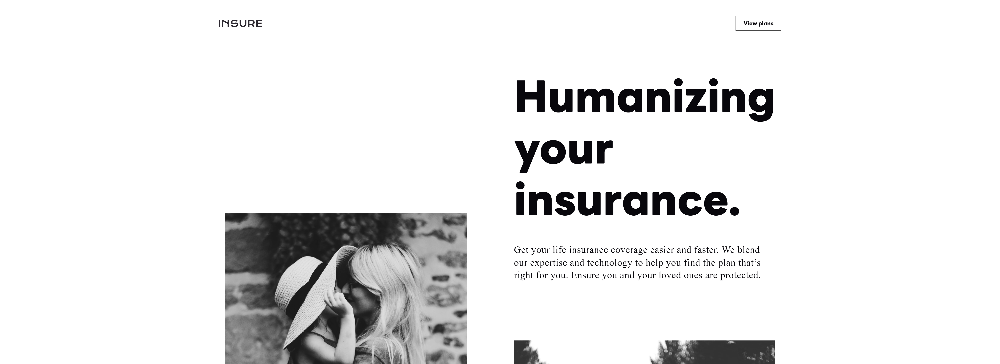

# Frontend Mentor - Insure landing page solution

This is a solution to the [Insure landing page challenge on Frontend Mentor](https://www.frontendmentor.io/challenges/insure-landing-page-uTU68JV8).

## Overview

### The challenge

Users should be able to:

- View the optimal layout for the site depending on their device's screen size
- See hover states for all interactive elements on the page

### Screenshot

### Links

- Solution URL: [O_o](https://github.com/Shadow-IO-oI/insure-landing-page-master)
- Live Site URL: [^_^](https://insure-rho.vercel.app)

## My process

### Built with

- Semantic HTML5 markup
- CSS custom properties
- Flexbox
- CSS Grid
- Mobile-first workflow
- GSAP

### Useful resources

- [calhern](https://calhern.frostype.xyz/) - This inspired me
- [Hyperplexed](https://www.youtube.com/watch?v=joDhIH6Xumw&t=26s) - CSS gradient hover effect
- [Apurba Deka](https://www.youtube.com/watch?v=yWE0Aa09lXI&list=PL9b5rejKX7275j9l6dPNv0So-6UOMH56J&index=32) - CSS button hover effect

## Author

- Frontend Mentor - [@Shadow-IO-oI](https://www.frontendmentor.io/profile/Shadow-IO-oI)